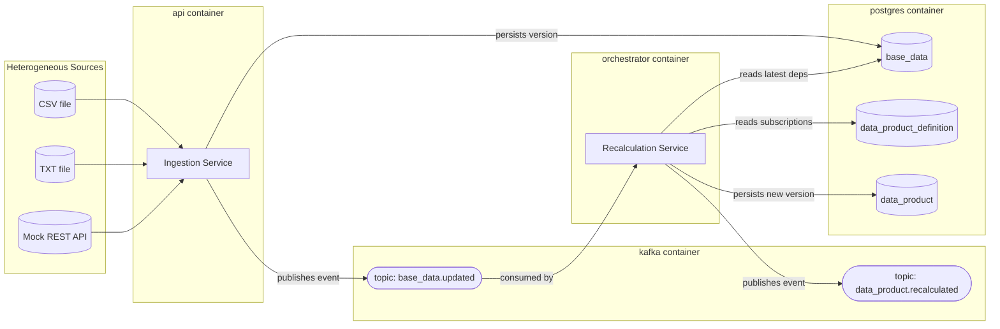

<div align="center">

# Event-Driven Data Product Platform

**A reference implementation of a decentralized, Data Mesh–inspired architecture
with active metadata and a reactive event-driven control plane.**

[](https://www.python.org/)
[](https://fastapi.tiangolo.com/)
[](https://kafka.apache.org/)
[](https://www.postgresql.org/)
[](https://docs.astral.sh/uv/)
[](https://docs.docker.com/compose/)
[](./LICENSE)

</div>

---

## Table of Contents

- [Overview](#overview)
- [Architecture](#architecture)
- [Core Concepts](#core-concepts)
- [Project Structure](#project-structure)
- [Prerequisites](#prerequisites)
- [Getting Started](#getting-started)
- [One-Key Observability Workflow (VS Code)](#one-key-observability-workflow-vs-code)
- [API Reference](#api-reference)
- [Walkthrough: The GDP Case Study](#walkthrough-the-gdp-case-study)
- [Simulating New Data Arriving](#simulating-new-data-arriving)
- [Manual Observability (without VS Code)](#manual-observability-without-vs-code)
- [Environment Variables](#environment-variables)
- [Development](#development)
- [Troubleshooting](#troubleshooting)
- [Academic Context](#academic-context)
- [License](#license)

---

## Overview

This project implements the platform architecture proposed in the dissertation
*"Event-Driven Data Product Architecture: Active Metadata and Federated
Governance"* — a **Data Mesh**–inspired system that structurally separates
**Base Data** (high-fidelity source preservation) from **Data Products**
(governed, business-rule-driven compositions), synchronized through an
**event-driven control plane** instead of static batch pipelines.

The reference use case is a simplified monthly **GDP indicator**, computed as
a weighted average of two upstream Base Data assets (industrial production and
services revenue) ingested from three heterogeneous mock sources — a CSV file,
a TXT file, and a mock REST API — demonstrating that the platform can absorb
new source formats without touching its core logic.

Every Base Data and Data Product record is **immutable and versioned**, and
every Data Product carries a `composition_lineage`: the exact upstream
versions and timestamps it was computed from — the structural foundation for
auditability and traceability described in the dissertation.

## Architecture



**Container segregation is deliberate.** The `api` container only *produces*
Kafka events; the `orchestrator` container only *consumes* them. They share
the same Docker image but run as fully independent processes — if one goes
down, the other keeps working, with Postgres and Kafka as the only points of
contact between them. See [Troubleshooting](#troubleshooting) and the
in-repo docstrings for the reasoning behind every resilience choice
(`enable_auto_commit=False`, idempotent Kafka producer, partition keying by
entity id, etc.).

## Core Concepts

| Concept | What it means here |
|---|---|
| **Base Data** | An immutable, versioned raw/near-raw reading from a single external source (e.g. `base_industrial_production`). Analogous to a Data Lake layer. |
| **Data Product** | An immutable, versioned, curated output composed from one or more Base Data assets plus a business rule (e.g. `monthly_gdp`). |
| **Active Metadata** | Metadata that *triggers* behavior (a recalculation) rather than merely describing state after the fact. |
| **4-Dimensional Metadata** | Every asset carries **Technical**, **Operational**, **Business**, and **Governance** metadata, strictly validated with Pydantic (`extra="forbid"`). |
| **Composition Lineage** | The exact upstream `base_data_id` + `version` + `timestamp_used` a Data Product version was computed from — the audit trail. |
| **Control Plane** | The orchestrator: it reacts to `base_data.updated` events and recomputes every dependent Data Product automatically. |

## Project Structure

```
event-driven-data-product-architecture/
├── docker-compose.yml          # postgres, kafka, api, orchestrator
├── Dockerfile                  # single image, two entrypoints
├── pyproject.toml / uv.lock    # dependency management (uv)
├── .env.example                # documents env vars for host-side runs
├── data/                       # mock heterogeneous sources (CSV, TXT)
├── scripts/
│   ├── trigger_demo.py         # end-to-end demo driver (via HTTP)
│   ├── start_stack.sh          # build + up + wait-until-healthy
│   ├── wait_for_stack.sh       # polls /health with timeout
│   ├── watch_table.sh          # live-loop a Postgres query
│   └── watch_kafka_topic.sh    # stream raw Kafka topic traffic
├── .vscode/
│   ├── tasks.json              # Ctrl+Shift+B observability workflow
│   └── extensions.json         # recommended extensions
└── src/datamesh/
    ├── domain/                 # metadata, events, ingestion contracts (pure)
    ├── infrastructure/         # SQLModel tables, DB engine, Kafka producer
    ├── application/            # use cases: ingest, recalculate, business rules
    ├── adapters/sources/       # CSV / TXT / API connectors + registry
    ├── api/                    # === api container === FastAPI app
    └── orchestrator/           # === orchestrator container === Kafka consumer
```

## Prerequisites

- **Docker** + **Docker Compose v2** (`docker compose version`)
- **[uv](https://docs.astral.sh/uv/)** — used to run host-side scripts (the demo driver) with the exact pinned dependencies from `uv.lock`
- (Optional, for VS Code workflow) **VS Code** with the recommended extensions from `.vscode/extensions.json`

## Getting Started

```bash
# 1. Install host-side dependencies (used by scripts/trigger_demo.py)
uv sync

# 2. Build and start every container
docker compose up --build -d

# 3. Confirm the API is up
curl http://localhost:8000/health
# → {"status":"ok"}

# 4. Run the end-to-end demo
uv run python scripts/trigger_demo.py
```

If you use VS Code, steps 2–3 (plus six live observability terminals) are a
single keystroke away — see the next section.

## One-Key Observability Workflow (VS Code)

Press **`Ctrl+Shift+B`** (`Cmd+Shift+B` on macOS). This runs the default build
task defined in `.vscode/tasks.json`, which:

1. Builds and starts the full stack, blocking until `/health` responds (no
   blind `sleep`s — it genuinely waits for readiness).
2. Opens **six long-running terminals**, grouped by what they let you observe:

| Group | Terminals | What you're watching |
|---|---|---|
| **1 — Application Logs** | `📡 API Logs`, `⚙️ Orchestrator Logs` | Requests hitting the API; the orchestrator reacting to events |
| **2 — Kafka Message Bus** | `📨 base_data.updated`, `📨 data_product.recalculated` | Raw event traffic, exactly as it travels on the wire |
| **3 — Postgres Tables** | `🗄️ base_data`, `🗄️ data_product` | Live table state, refreshing every 15 seconds |

Terminals within the same group are placed in the same panel/column, so
related views stay next to each other instead of scattering across the
screen. Each terminal is `dedicated`, meaning re-running the build task
reuses the same terminal instead of piling up new ones.

Additional on-demand tasks (via **`Ctrl+Shift+P` → "Tasks: Run Task"`**):

- `▶️ Run Demo Script (trigger_demo.py)`
- `🩺 Health Check`
- `🔨 Rebuild (no cache)`
- `🛑 Stop Stack`
- `🔥 Stop & Wipe Volumes (reset Postgres data)`

## API Reference

| Method | Path | Description |
|---|---|---|
| `GET` | `/health` | Liveness probe |
| `GET` | `/connectors` | List available source connectors |
| `POST` | `/ingest/{connector_name}` | Run a connector, persist a new Base Data version, emit `base_data.updated` |
| `GET` | `/base-data/{base_data_id}` | Latest version + full metadata of a Base Data asset |
| `GET` | `/data-products/{product_id}` | Latest computed version + `composition_lineage` of a Data Product |
| `GET` | `/data-products/{product_id}/history` | Full auditable version history of a Data Product |

Available connectors out of the box: `csv_industrial`, `txt_services`, `api_industrial`.

## Walkthrough: The GDP Case Study

The formula (dissertation Eq. 4.1): `GDP = 0.4 × industrial_production + 0.6 × services_revenue`

```bash
# 1) Ingest both dependencies of monthly_gdp
curl -X POST http://localhost:8000/ingest/csv_industrial   # → base_industrial_production v1 = 112.5
curl -X POST http://localhost:8000/ingest/txt_services      # → base_services_revenue v1 = 340.8

# 2) The orchestrator reacts automatically — check the computed product
curl http://localhost:8000/data-products/monthly_gdp
```

Expected result: `GDP v1 = 0.4×112.5 + 0.6×340.8 = 249.48`, with
`composition_lineage = [base_industrial_production@v1, base_services_revenue@v1]`.

```bash
# 3) A fresh industrial-production reading arrives via the mock API
curl -X POST http://localhost:8000/ingest/api_industrial     # → base_industrial_production v2 = 121.7

# 4) monthly_gdp recalculates on its own — no manual trigger
curl http://localhost:8000/data-products/monthly_gdp
```

Expected result: `GDP v2 = 0.4×121.7 + 0.6×340.8 = 253.16`, with lineage now
pointing to `base_industrial_production@v2` (the new reading) while
`base_services_revenue@v1` stays unchanged (it wasn't updated) — proof that
the lineage tracks *exactly* which versions fed each computation.

```bash
# 5) Full auditable history
curl http://localhost:8000/data-products/monthly_gdp/history
```

Or simply run `uv run python scripts/trigger_demo.py`, which performs all of
the above and prints a formatted summary.

## Simulating New Data Arriving

**File-backed sources (`csv_industrial`, `txt_services`):** append a new row
to the underlying file, then rebuild and re-ingest — the connectors always
read the *last* row.

```bash
echo "2026-02,118.9" >> data/industrial_production.csv
docker compose build --no-cache api orchestrator && docker compose up -d
curl -X POST http://localhost:8000/ingest/csv_industrial
```

**Mock API source (`api_industrial`):** its value is currently fixed in
`src/datamesh/adapters/sources/api_source.py`. To simulate arbitrary
"incoming" readings without editing files or rebuilding, the ingestion route
can be extended to accept optional `value`/`reference_period` query
parameters that build a throwaway connector instance per request — ask if
you'd like that patch applied; it keeps the shared singleton connector
untouched and only affects `api_industrial` calls.

## Manual Observability (without VS Code)

Everything the VS Code tasks automate can be run by hand, in separate terminals:

```bash
# Application logs
docker compose logs -f api
docker compose logs -f orchestrator

# Raw Kafka traffic
bash scripts/watch_kafka_topic.sh base_data.updated
bash scripts/watch_kafka_topic.sh data_product.recalculated

# Live Postgres tables
bash scripts/watch_table.sh "SELECT * FROM base_data ORDER BY created_at DESC;"
bash scripts/watch_table.sh "SELECT * FROM data_product ORDER BY created_at DESC;"
```

## Environment Variables

Only relevant when running scripts **outside** Docker Compose (containers get
these from the `environment:` block in `docker-compose.yml` instead). Copy
`.env.example` to `.env` to override defaults.

| Variable | Default | Description |
|---|---|---|
| `POSTGRES_HOST` | `localhost` (compose: `postgres`) | Postgres hostname |
| `POSTGRES_PORT` | `5432` | Postgres port |
| `POSTGRES_USER` | `datamesh` | Postgres user |
| `POSTGRES_PASSWORD` | `datamesh` | Postgres password |
| `POSTGRES_DB` | `datamesh` | Postgres database name |
| `KAFKA_BOOTSTRAP_SERVERS` | `localhost:9092` (compose: `kafka:9092`) | Kafka broker address |

## Development

```bash
uv sync --all-extras         # install dev dependencies (ruff, mypy)
uv run ruff check .          # lint
uv run mypy src              # strict type checking (see [tool.mypy])
```

## Troubleshooting

**`500 Internal Server Error` on `/ingest/csv_industrial` — "CSV source is empty"**
The `data/*.csv` / `data/*.txt` mock files are missing or empty inside the
built image. Confirm their content on the host, then force a clean rebuild
(the image caches the `COPY data ./data` layer):
```bash
cat data/industrial_production.csv    # should NOT be empty
docker compose build --no-cache api orchestrator
docker compose up -d
```

**`monthly_gdp` never appears / stays 404**
It needs *both* dependencies ingested at least once. Check
`GET /base-data/base_industrial_production` and
`GET /base-data/base_services_revenue` — if either 404s, ingest it first.

**Orchestrator logs show connection errors right after startup**
Kafka's healthcheck can pass a few seconds before it reliably accepts
producer/consumer connections. `scripts/wait_for_stack.sh` mitigates this by
polling `/health` (which itself depends on the Kafka producer connecting)
before the observability terminals open. If it still happens, just retry the
ingestion — messages aren't lost, only delayed.

**Containers keep restarting**
```bash
docker compose ps
docker compose logs postgres
docker compose logs kafka
```
Most often a stale `pgdata` volume from an earlier schema. Reset with
`docker compose down -v` (⚠️ deletes all persisted data) and start again.

## Academic Context

This platform is the reference implementation for my Master's dissertation,
*"Event-Driven Data Product Architecture: Active Metadata and Federated
Governance,"* developed at the Institute of Mathematics and Statistics (IME),
University of São Paulo (2026).

**Author:** Thales Vieira e Silva Lobo de Almeida
**Advisor:** Prof.ª Dr.ª Kelly Rosa Braghetto
**Program:** Computer Science, IME-USP

## License

See the [LICENSE](./LICENSE) file for details.
